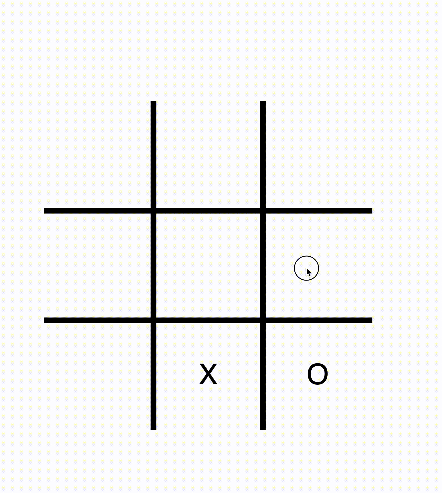

# intelligent-tic-tac-toe ([Try it!](https://moisesadame.github.io/intelligent-tic-tac-toe/))
🧠 An AI powered Tic-Tac-Toe

## Overview
This was based on [Minimax Algorithm](https://en.wikipedia.org/wiki/Minimax) and the code 154th coding challeng from [The Coding Train](https://www.youtube.com/@TheCodingTrain).

## Tools
Written in JavaScript with ❤️ using the [p5.js](https://p5js.org/) library.
 

